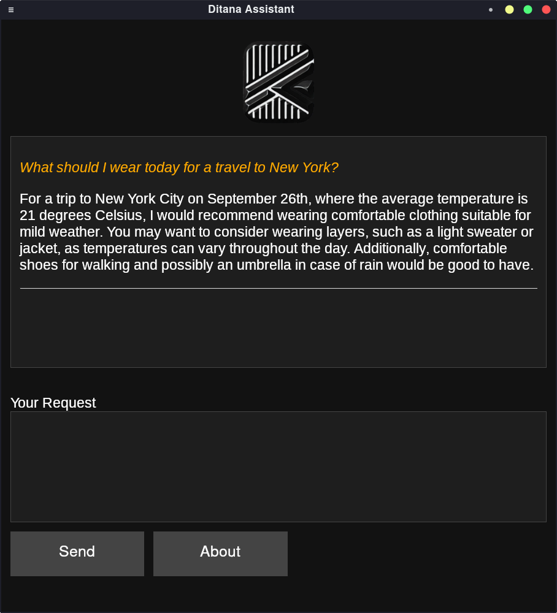
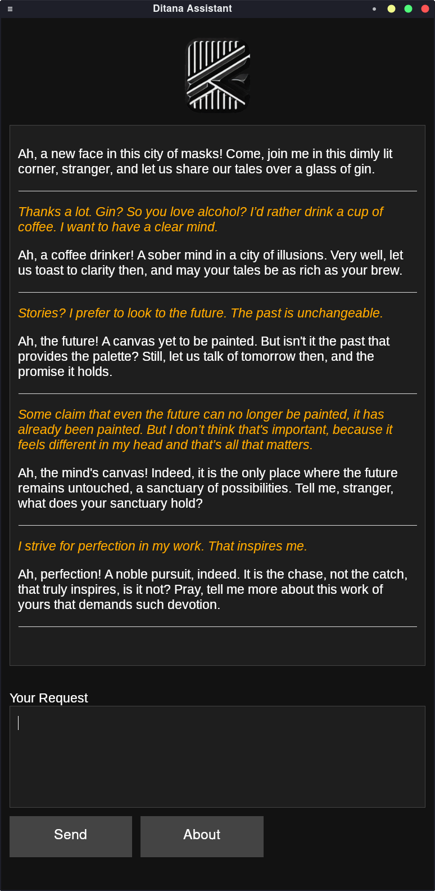
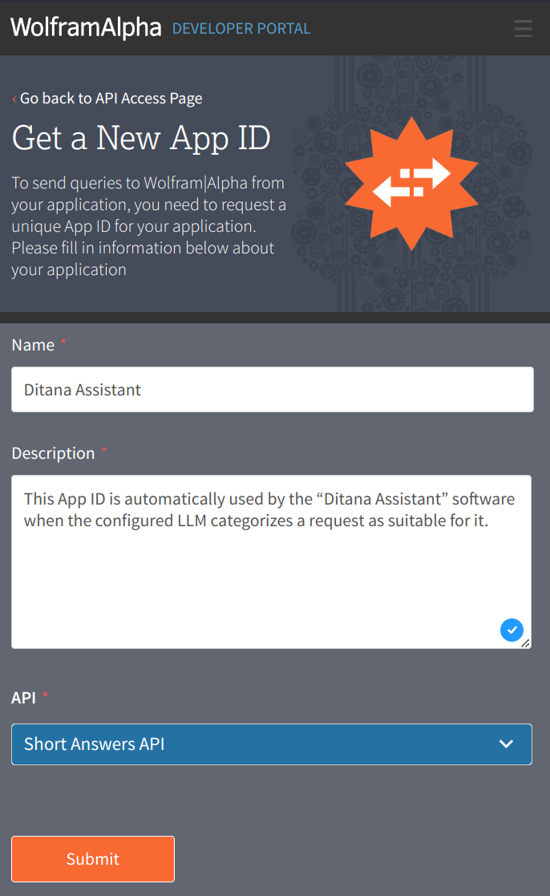

# Ditana Assistant

Ditana Assistant is an innovative AI-powered application that combines a graphical user interface with terminal functionality and, optionally, Introspective Contextual Augmentation via Wolfram|Alpha. Even without Wolfram|Alpha, the Introspective Contextual Augmentation (ICA) enhances AI responses in many cases (see [Example Sessions](#example-sessions) for more details).

It leverages Large Language Models (LLMs) to provide intelligent assistance similar to the native browser interfaces of AI service providers.

The name stems from its integration into the Arch-based Linux distribution [Ditana GNU/Linux](https://ditana.org), but it runs on other Linux distributions, macOS, and Windows (including PowerShell support).

Simply ask your question in natural language, for example

- _What are the largest files in the current directory and below?_
- _Is the network name resolution service running stably?_
- _Which process is consuming so much CPU time?_
- _Replace all occurrences of the word 'sun' with 'moon' in the file ./project/test_
- _What’s my current audio device?_

For complete sessions, see [Examples](#example-sessions).

## Key Features

- **AI Integration**: Uses a [KoboldCpp](https://github.com/LostRuins/koboldcpp/wiki) server with the [Google Gemma model](https://ai.google.dev/gemma/docs/base).
- **Flexible Configuration**: Can be configured to use OpenAI models through a simple YAML [configuration file](#configuration).
- **OS Interaction**: Capable of interacting with the operating system, suggesting and executing terminal commands upon user confirmation, see [example sessions](#terminal-command-generation-examples).
- **Optional Wolfram|Alpha Integration**: Automatically attempts to augment the LLM’s context via communication with the official [Wolfram|Alpha Short Answers API](https://products.wolframalpha.com/short-answers-api/explorer).
- **Introspective Contextual Augmentation (ICA)**: Enhances AI responses by automatically gathering and incorporating relevant contextual information through introspective reasoning.
See [Introspective Contextual Augmentation](#introspective-contextual-augmentation-ica) for more details.
- **Multi-Platform**: Runs on Linux, macOS, and Windows, adapting to each environment automatically by [collecting context of the running system](#assistance-based-on-your-specific-system).
- **Dual-Mode Operation**: Functions both as a [GUI application](#gui-mode) and a stand-alone [terminal tool](#command-line-interface) for quick command generation and embedding of answers in scripts.
- **Pastime Mode**: Engage in [human-like conversations](#pastime-mode) with an AI companion, optionally impersonating specific characters or personalities.
- **Intelligent Caching**: Implements a [sophisticated request caching system](#intelligent-caching) for both Wolfram|Alpha and LLM queries, optimizing API usage and response times.

## Table of Contents

<!-- toc -->

- [Usage](#usage)
  * [Command-line Interface](#command-line-interface)
  * [GUI Mode](#gui-mode)
  * [Pastime Mode](#pastime-mode)
  * [Intelligent Caching](#intelligent-caching)
- [Installation](#installation)
  * [Ditana GNU/Linux](#ditana-linux)
  * [Arch Linux and Arch-based Distributions](#arch-linux-and-arch-based-distributions)
  * [Other Linux Distributions, Windows, and macOS](#other-linux-distributions-windows-and-macos)
  * [Prerequisites](#prerequisites)
- [Configuration](#configuration)
  * [Available Configuration Options:](#available-configuration-options)
  * [Configuration Option Details](#configuration-option-details)
  * [Using OpenAI](#using-openai)
  * [Using Wolfram|Alpha](#using-wolframalpha)
- [Use Cases](#use-cases)
  * [Maximizing the Underlying AI Model’s Potential](#maximizing-the-underlying-ai-models-potential)
  * [Terminal Command Generation](#terminal-command-generation)
  * [Assistance Based on Your Specific System](#assistance-based-on-your-specific-system)
  * [All Use Cases of Wolfram|Alpha](#all-use-cases-of-wolframalpha)
  * [Introspective Contextual Augmentation (ICA)](#introspective-contextual-augmentation-ica)
- [Example Sessions](#example-sessions)
  * [Terminal command generation examples](#terminal-command-generation-examples)
  * [Introspective Contextual Augmentation (ICA) examples](#introspective-contextual-augmentation-ica-examples)
- [Collaboration](#collaboration)
- [Sponsorship](#sponsorship)
- [Current Project Status](#current-project-status)
  * [Platform Support](#platform-support)
  * [Ongoing and Future Development](#ongoing-and-future-development)
- [Important Notes](#important-notes)
- [Licensing](#licensing)
- [Author](#author)

<!-- tocstop -->

## Usage

### Command-line Interface

```bash
ditana-assistant [OPTIONS] [TASK]
```

Options:
- `-h`, `--help`: Show help message and exit.
- `-v`, `--version`: Show the version of Ditana Assistant and exit.
- `-u`, `--gui`: Display a graphical dialog.
- `-a`, `--augmentation`: Enable [Introspective Contextual Augmentation (ICA)](#introspective-contextual-augmentation-ica) for enhanced AI responses.
- `-w`, `--wolfram-alpha`: Force use of [Wolfram|Alpha](#all-use-cases-of-wolframalpha) for first prompt.
- `-q`, `--quiet`: Run in quiet mode. No progress output, no continuation of dialog (except confirmation of command execution).
- `-p`, `--pastime`: Activate Pastime mode for engaging in human-like conversations.
- `-i IMPERSONATE`, `--impersonate IMPERSONATE`: In Pastime mode, optionally impersonate a specified person or character.

Ditana Assistant supports specifying arbitrary tasks via command line arguments, which are then used as the initial prompt.
This feature allows for versatile usage, from simple calculations to complex queries.

For instance, you can use Ditana Assistant as a sophisticated calculator:

```bash
❯ ./ditana-assistant --quiet "solve x^2 + 2x + 5 = 0"
the 1st is x equals minus 1 minus 2 times i and the 2nd is x equals minus 1 plus 2 times i
```

This example demonstrates a direct output from Wolfram|Alpha’s Short Answers API, used for immediately suitable queries.
Therefore, the language style of the output can be more formal than the natural style of LLMs.
However, in the majority of cases, Ditana Assistant employs Wolfram|Alpha internally for [Introspective Contextual Augmentation](#key-features),
enabling a powerful synergy between Wolfram|Alpha and the LLM to generate more comprehensive responses.

The complexity of the responses scales with the nature of your query.
For more intricate tasks, Ditana Assistant can provide detailed, comprehensive answers.
Please refer to the [Example Sessions](#example-sessions) section for demonstrations of more advanced use cases.

Note: The `--quiet` flag is used in this example to display only the assistant’s response without additional output.

### GUI Mode

To start Ditana Assistant in GUI mode:

```bash
ditana-assistant -u
```



This screenshot illustrates the seamless integration of real-time data from the Wolfram|Alpha API, which is automatically accessed as needed. The assistant leverages this capability to provide up-to-date and context-aware responses.

For a more comprehensive understanding of the assistant’s capabilities, please refer to the [Use Cases](#maximizing-the-underlying-ai-models-potential) and [Example Sessions](#example-sessions).

### Pastime Mode

Pastime mode allows users to engage in human-like conversations with the AI assistant.
This feature is particularly effective when using more advanced language models like gpt-4o-mini (see section [Configuration](#configuration))

To activate Pastime mode:

```bash
ditana-assistant -p
```

To impersonate a specific character or personality:

```
ditana-assistant -p -i "Detective Sherlock Holmes"
Ah, good afternoon. So you're the one who asked me for help.
Please tell me everything you know about the incident.

Your Message (‘enter’ to quit): All I know is that there was a lot of fog.
I could hardly see anything. And suddenly the car was gone. Just disappeared. It was terrible.

Interesting. Can you tell me more about the car? Make, colour, registration number?

Your Message (‘enter’ to quit): It was a green VW Beetle. Licence plate number MN P-16.

Thank you for the information. Did you see any suspects or people behaving suspiciously?

Your Message (‘enter’ to quit): Precisely not, because of the fog. I only remember that,
strangely enough, a parrot flew past just before the incident. That's very strange,
because parrots are not native to this area.

A parrot, you say? That is indeed unusual. Have you noticed anything else that you think
is important?
```

The above conversation was done using `gpt-3.5-turbo`. Another example, using `gpt-4` (without `-i`):



Note: While Pastime mode is functional with the Gemma model, it performs best with more advanced models like gpt-4o-mini. The conversations with Gemma may be less engaging and limited in scope.

### Intelligent Caching

Ditana Assistant implements a sophisticated request caching system for both Wolfram|Alpha and LLM queries. This feature optimizes API usage and improves response times, especially for repeated or similar queries.

Key aspects of the caching system:
- Caches all outgoing requests to APIs.
- Implements an intelligent lifetime management for cache entries.
- Adapts cache lifetime based on the stability of responses.
- Initial cache lifetime depends on API: 1 week for LLMs, ≈ 11 minutes for Wolfram|Alpha.
- Particularly beneficial for internal queries made by Ditana Assistant, which often lack dialog history.
- Maximum cache size can be [configured](#advanced-configuration).

This caching mechanism significantly reduces API calls, especially for short, repetitive queries, leading to improved performance and reduced API usage.

## Installation

### Ditana GNU/Linux

Ditana Assistant is integrated into the Ditana GNU/Linux distribution with native Arch packages. For more information, visit [https://ditana.org](https://ditana.org).

The corresponding package in the Ditana Arch repository is `ditana-assistant`. Note that this package does not depend on the [ditana-koboldcpp AUR package](https://aur.archlinux.org/packages/ditana-koboldcpp), because you have free choice of which AI API you want to use, including OpenAI.
`ditana-koboldcpp` includes an optimized configuration for the Gemma language model.
In KoboldCpp operation mode, the assistant makes use of [Gemma’s prompt format](https://ai.google.dev/gemma/docs/formatting).

### Other Linux Distributions, Windows, and macOS

For other platforms, including Windows and macOS, you can install Ditana Assistant from source using [Poetry](https://python-poetry.org):

1. Clone the repository:
   ```bash
   git clone https://github.com/acrion/ditana-assistant.git
   cd ditana-assistant
   ```

2. Install Poetry:
   ```bash
   pip install poetry
   ```
   
3. Install ditana-assistant’s dependencies:
   ```bash
   poetry install
   ```
   This command will create a virtual environment (if one does not already exist) and install all dependencies listed in the `pyproject.toml` file.
   To execute ditana-assistant, you need to spawn a shell within the virtual environment with this command:

   ```bash
   poetry shell
   ```
   
   The dependencies include either an [OpenAI API key](https://platform.openai.com/account/api-keys) or a local [KoboldCpp server](https://github.com/LostRuins/koboldcpp/wiki).
   For the latter, please consider using Google’s [Gemma LLM](https://ai.google.dev/gemma) ([Download](https://huggingface.co/bartowski/gemma-2-2b-it-GGUF/resolve/main/gemma-2-2b-it-Q6_K.gguf)),
   as Ditana Assistant utilizes [Gemma’s Instruct Tag Format](https://ai.google.dev/gemma/docs/formatting).
   For this, you should select the Instruct Tag Preset `Gemma 2` in KoboldCpp’s Format settings.

#### Why no requirements.txt?

Ditana Assistant uses **Poetry** to manage dependencies, which eliminates the need for a `requirements.txt` file.
Poetry provides a `pyproject.toml` file to define dependencies and a `poetry.lock` file to lock the exact versions of these dependencies for consistency across different environments.
This approach simplifies dependency management by ensuring that all environments use the exact same versions, reducing potential conflicts.

For more information on how Poetry manages dependencies, visit the [Poetry documentation](https://python-poetry.org/docs/).

### Prerequisites

Ditana Assistant supports two main operating modes:

1. **Local operation with KoboldCpp:**
   - A running [KoboldCpp server](https://github.com/LostRuins/koboldcpp/wiki) is required.
   - In KoboldCpp operation mode, the Ditana Assistant makes use of [Gemma’s prompt format](https://ai.google.dev/gemma/docs/formatting).
   - You can download the recommended model here: [gemma-2-2b-it-GGUF](https://huggingface.co/bartowski/gemma-2-2b-it-GGUF).
   - Arch Linux users can get everything required by installing the [ditana-koboldcpp AUR package](https://aur.archlinux.org/packages/ditana-koboldcpp).

2. **Cloud-based operation with OpenAI API:**
   - Alternatively, you can use the OpenAI API without any local model setup.
   - This requires [configuration](#configuration) and an [OpenAI API key](https://platform.openai.com/account/api-keys).

Choose the mode that best fits your needs and system capabilities.

## Configuration

The Ditana Assistant configuration is stored in a YAML file located at:

- Linux: `~/.config/ditana-assistant/config.yaml`
- macOS: `~/Library/Application Support/ditana-assistant/config.yaml`
- Windows: `C:\Users\<username>\AppData\Local\ditana-assistant\config.yaml`

### Available Configuration Options:

```yaml
assume_english: false
enable_experimental_features: false
generate_terminal_cmd: true
koboldcpp_base_url: http://localhost:5001  # when using Gemma
model_cache_size: 20
model_cache_start_lifetime_sec: 604800
model_type: gemma # or 'openai'
offer_cmd_execution: true
openai_model: gpt-4o-mini  # when using OpenAI
show_debug_messages: false
wolfram_alpha_cache_size: 1
wolfram_alpha_cache_start_lifetime_sec: 675
wolfram_alpha_error_cache_size: 1
wolfram_alpha_error_cache_start_lifetime_sec: 604800
wolfram_alpha_short_answers_app_id: '' # https://developer.wolframalpha.com
```

### Configuration Option Details

#### Core Functionality Settings

- `model_type`: Specifies the AI model to use. Currently, `gemma` for KoboldCpp and `openai` for OpenAI models are supported. Also see [Using OpenAI](#using-openai).
Default: `gemma` (requires local [KoboldCpp server](#prerequisites))

- `koboldcpp_base_url`: The base URL of the KoboldCpp server, used when `model_type` is set to `gemma`. Default: `http://localhost:5001`

- `openai_model`: The specific OpenAI model to use when model_type is set to openai, see [Using OpenAI](#using-openai). Default: `gpt-4o-mini`

- `wolfram_alpha_short_answers_app_id`: The App ID for Wolfram|Alpha’s Short Answers API, see [Using Wolfram|Alpha](#using-wolframalpha). Default: `''`'

- `generate_terminal_cmd`: If enabled, the wizard will analyse the user’s input to see if it relates to their computer and can be solved by a terminal command. The terminal command is only offered for execution if `offer_cmd_execution` is also enabled. Default: `true`.

- `offer_cmd_execution`: If enabled, the assistant will offer to execute detected terminal commands based on the output. This usually happens together with `generate_terminal_cmd`, but not necessarily. Default: `true`.

#### Advanced Configuration

- `assume_english`: If set to true, the assistant will assume all text is in English without performing language detection. 
Language detection is only used for specific use cases such as Wolfram|Alpha or internal meta-requests that need to be combined with the user prompt. Default: `false`.

- `enable_experimental_features`: Activates experimental features for development and testing purposes. This is intended for internal use to systematically test new functionalities. Use with caution as features are still in development. Default: `false`.

- `model_cache_size`: Maximum size (in MiB) of the cache used for model responses. Note that the actual cache file size will be approximately 1/3 larger due to JSON formatting overhead. Default: `20` MiB.

- `model_cache_start_lifetime_sec`: The initial lifetime (in seconds) for model cache entries. When this period expires, the cache entry is re-evaluated; if a new response matches the cached one, the lifetime is extended, otherwise, it is shortened. Default: `604800` seconds (1 week).

- `show_debug_messages`: Controls whether debug messages are displayed during the assistant’s operation. Useful for troubleshooting. Default: `false`.

- `wolfram_alpha_cache_size`: Maximum size (in MiB) of the cache used for storing responses from the Wolfram|Alpha API. The actual file size will be approximately 1/3 larger due to JSON syntax. Default: `1` MiB.

- `wolfram_alpha_cache_start_lifetime_sec`: The initial lifetime (in seconds) for Wolfram|Alpha cache entries. The lifetime is adjusted based on whether subsequent API responses remain consistent or change. Default: `675` seconds.

- `wolfram_alpha_error_cache_size`: Maximum size (in MiB) of the cache used for failed Wolfram|Alpha API requests. This helps avoid repeated requests for errors. Default: `1` MiB.

- `wolfram_alpha_error_cache_start_lifetime_sec`: The initial lifetime (in seconds) for entries in the error cache. Lifetimes are adjusted based on whether the error persists. Default: `604800` seconds (1 week).

### Using OpenAI

Set the `OPENAI_API_KEY` environment variable with your [OpenAI API key](https://platform.openai.com/account/api-keys) when configuring OpenAI models (see below config entries `model_type` and `openai_model`).
As of October 2024, gpt-4o-mini is a factor of 20 cheaper than gpt-3.5-turbo: [$0.150 / 1M input tokens](https://openai.com/api/pricing).
According to [https://platform.openai.com/docs/models/gpt-3-5-turbo](https://platform.openai.com/docs/models/gpt-3-5-turbo):
  > "As of July 2024, gpt-4o-mini should be used in place of gpt-3.5-turbo, as it is cheaper, more capable, multimodal, and just as fast. gpt-3.5-turbo is still available for use in the API."

Note that the number of API accesses is reduced by Ditana Assistant’s sophisticated [caching algorithm](#intelligent-caching).

### Using Wolfram|Alpha

Obtain an App ID by creating a "Short Answers API Key" on https://developer.wolframalpha.com and set the config entry `wolfram_alpha_short_answers_app_id` to its value.
Make sure to select `Short Answers API` in the dialog:  
  
  
Currently, 2000 accesses per month [are free](https://products.wolframalpha.com/api).
Note that the number of API accesses is reduced by Ditana Assistant’s sophisticated [caching algorithm](#intelligent-caching).

## Use Cases

### Maximizing the Underlying AI Model’s Potential

Ditana Assistant is designed to maximize the potential of its underlying AI model, offering capabilities that surpass typical browser-based interactions:

1. **[Integration of Multiple Knowledge Sources](#ica-example-1-using-gpt-35-turbo-and-wolframalpha)**: By combining the AI model’s capabilities with Wolfram|Alpha’s factual database (when enabled), Ditana Assistant offers a broader range of assistance, from creative problem-solving to precise calculations and up-to-date information.

2. **[Introspective Contextual Augmentation (ICA)](#introspective-contextual-augmentation-ica)**: By introspectively augmenting the context of queries, Ditana Assistant provides more accurate and relevant responses. This feature improves AI answers in many cases, even when used without Wolfram|Alpha.

3. **[System-Specific Context](#assistance-based-on-your-specific-system)**: The assistant automatically adds information about your specific system environment, allowing for more precise and tailored responses. This context includes details about your operating system, shell type, and running applications.

### Terminal Command Generation

- Generating complex terminal commands
- Process and performance monitoring
- File and system management
- Audio device configuration
- Text manipulation in files
- System log analysis

See [Example Section](#terminal-command-generation-examples) for demonstration.

### Assistance Based on Your Specific System

Currently, the following information is collected from your system to tailor the LLM’s answers to your needs:

- The type of shell you started the Assistant from (important for terminal commands)
- The desktop type
- Running desktop applications
- Your date, time and time zone
- Your preferred language (based on your temporal locale identifier, platform-independent)
- In Terminal Mode, the current directory

### All Use Cases of Wolfram|Alpha

- Real-time information like statistics such as population, weather and much more (see [sample session](#ica-example-1-using-gpt-35-turbo-and-wolframalpha))
- Mathematics (see [sample session](#command-line-interface))
- [Factual, highly accurate knowledge](https://www.wolframalpha.com/knowledgebase) without the occasional inconsistencies or inaccuracies that may occur with LLMs

### Introspective Contextual Augmentation (ICA)

Introspective Contextual Augmentation is a powerful feature of Ditana Assistant that [significantly](#statistical-evaluation-and-optimization) enhances the quality and accuracy of AI responses. This innovative approach creates a synergy between various knowledge sources, including the AI model’s own introspective capabilities and Wolfram|Alpha (when enabled).

**Note: This feature is turned off by default.** Users can enable it through the UI or by using the `-a` command line switch when using the terminal tool.

#### Key Aspects of ICA

1. **Dynamic Information Gathering**:
   - The assistant automatically generates and processes contextual queries to supplement user inputs.
   - Adapts to each specific request, creating a more tailored response.

2. **Dual-Source Augmentation**:
   - With Wolfram|Alpha: Incorporates up-to-date information such as current weather, statistics, and more.
   - Without Wolfram|Alpha: Engages in self-dialogue, using the underlying LLM to answer contextual queries, enhancing response quality through introspection.

3. **Adaptive Contextual Queries**:
   - Dynamically generates relevant questions based on the user’s input.
   - These questions are answered either by Wolfram|Alpha or the LLM itself, creating a form of "inner monologue".

4. **Guided Introspective Reasoning**:
   - Incorporates contextual queries and their answers into the message history before addressing the main user prompt.
   - Guides the LLM through a structured, introspective approach to problem-solving.
   - Allows the model to break down complex problems and approach them more systematically, even when engaging in self-dialogue.
   - The main user prompt is kept unchanged, but with additional context due to the messages automatically inserted into the dialogue.

5. **Enhanced Problem-Solving**:
   - Leverages additional context and guided introspective reasoning.
   - Provides more comprehensive and accurate solutions to complex problems.

6. **Improved Accuracy**:
   - Reduces errors and inconsistencies in AI responses.
   - Provides additional relevant information and a structured thought process before addressing the main query.

7. **LLM Capability Maximization**:
   - Even without external sources like Wolfram|Alpha, helps the LLM leverage its own knowledge more effectively.
   - Utilizes a guided, multi-step introspective reasoning approach.

#### Example of ICA in Action

To illustrate how ICA works, here’s an example from the [MMLU multitask test](https://huggingface.co/datasets/cais/mmlu) (without using Wolfram|Alpha):

```
Question: A victim and a defendant both worked as longshoremen at a shipyard. After the victim
was shot to death, the defendant was tried for murder and acquitted. Following the acquittal,
the victim's estate sued the defendant in a wrongful death action. During the civil trial, the
victim's estate called a witness to testify. The witness, who worked with both men at the
shipyard, testified that two weeks before the shooting, the victim came to work with a broken
nose and said that the defendant had caused it. The attorney for the victim's estate then
asked the witness the following question, "Was the defendant present during your conversation
with the victim, and if so, did he say anything about the victim's broken nose?" The witness
replied, "Yes, the defendant was present, and after the victim told me that the defendant
broke his nose, the defendant said, And that's only the beginning." Upon objection by the
defendant's attorney, the witness's testimony is

Choices:
B. admissible, because it reports a declaration against interest.
C. admissible, because it reports the defendant's adoptive admission of the victim's assertion.
D. inadmissible, because of the principle of collateral estoppel.
E. inadmissible, because it is hearsay not within any recognized exception.

Correct answer: C

Model’s answer (without ICA feature): E

                            systematic contextual query: "What legal principle governs the admissibility of the witness's testimony regarding the defendant..."
                             answer to systematic query: "In the scenario, a victim and a defendant, both longshoremen at a shipyard, were involved in a ca..."
   Are you sure? Please answer only with "yes" or "no".: "no."
                                      critical question: "What specific hearsay exception could potentially apply to the defendant's statement, and how mig..."
                            answer to critical question: "The specific hearsay exception that could potentially apply to the defendant's statement is the "..."
Model’s answer (with ICA feature): C
```

This example demonstrates how ICA guides the model through a series of contextual queries, helping it arrive at the correct answer.

Please note that the additional questions and answers you see in the above log merely reflect a subset of the internal processes, and in particular,
do not provide the context in which they occur. Furthermore, the generation of the questions is not logged. The objective of this log is to provide an overview
of the internal processes. While additional log outputs [can be enabled](#advanced-configuration), they clutter the output.

#### Technical Implementation

1. **Query Generation**:
   - Utilizes meta-questions to the LLM to generate contextual queries.
   - Employs meta-meta-questions to generate the questions themselves.
   - Developed through extensive trial and error to determine effective query strategies.

2. **Dialogue Structure**:
   - Creates independent dialogues separate from the main conversation.
   - The main dialogue is then constructed based on the context derived from these sub-dialogues.

3. **Prompt Engineering**:
   - Varies the prompt structure based on the current step in the procedure.
   - Converts LLM-generated questions (initially Assistant messages) into User messages for efficient processing.
   - Sometimes repeats dialogues within a single message instead of using separate messages, depending on efficiency requirements.

4. **Experimental Features**:
   - Explored recursive calls with limitations to ensure prompts become progressively shorter.
   - Implemented in the `generate_sub_prompts` function in the `text_processors_ai` module.
   - [Socratic method](https://en.wikipedia.org/wiki/Socratic_method) simulation (`socratic_method` function) attempted but not yet yielding statistically significant improvements.

#### Statistical Evaluation and Optimization

1. **Benchmark Tests**:
   - Utilized the [MMLU multitask test](https://huggingface.co/datasets/cais/mmlu) (14,042 questions) and the [ARC-Challenge test](https://huggingface.co/datasets/allenai/ai2_arc) (1,172 questions).
   - Optimization primarily conducted using the ARC-Challenge test.

2. **Performance Improvements**:
   - MMLU test: Corrected 188 (5.6%) of 3,348 initially incorrect answers using the OpenAI model `gpt-4o-mini`.
   - ARC-Challenge test: Fixed 26 out of 94 initially incorrect answers.

3. **Statistical Significance**:
   - Employed [McNemar’s statistical test](https://en.wikipedia.org/wiki/McNemar's_test) to verify improvements.
   - Achieved over 99% probability of significant differences in all cases.
   - Despite optimization on ARC-Challenge potentially affecting statistical significance, MMLU results confirmed the effectiveness.

4. **Methodology**:
   - Conducted tests without Wolfram|Alpha to evaluate the ICA process capability independently.
   - Ran the ARC-Challenge test multiple times (4) due to potential variations in LLM API responses.

5. **Documentation and Transparency**:
   - Complete test logs available for download [here](https://ditana.org/assistant/ica-benchmark-409f40f.log).
   - Logged subset of internal processes to provide an overview without cluttering output.

#### Evaluation Methodology for Multiple-Choice Questions

The evaluation of Large Language Models (LLMs) on multiple-choice questions presents unique challenges, particularly when using pre-existing datasets. This section outlines the methodology employed in this project, discussing its rationale and comparing it to other potential approaches.

##### Dataset Preparation and Prompt Engineering

It’s crucial to note that many multiple-choice datasets, including those from HuggingFace like [ai2_arc](https://huggingface.co/datasets/allenai/ai2_arc) and [cais_mmlu](https://huggingface.co/datasets/cais/mmlu),
provide only the question text and a list of answer choices.
They do not include a pre-formatted prompt suitable for direct input to an LLM. Consequently, researchers must design an appropriate prompt structure.

In this project, the `process_question` function was developed to transform raw dataset entries into suitable prompts. This function constructs a prompt that clearly delineates the question and answer choices, concluding with an explicit instruction for the model to provide the letter of the correct answer.

##### Challenges with Standard Evaluation Metrics

Initial attempts at evaluation utilized the HuggingFace [evaluate](https://github.com/huggingface/evaluate) library, specifically the [bertscore](https://huggingface.co/spaces/evaluate-metric/bertscore) and Google Research [rouge](https://huggingface.co/spaces/evaluate-metric/rouge) metrics.
These metrics are widely used for various natural language processing tasks.
However, manual verification of individual question evaluations revealed significant discrepancies in accurately identifying correct and incorrect responses in the multiple-choice context.

##### Development of a Specialized Evaluation Method

In response to these challenges, a specialized method for evaluating multiple-choice responses was developed.
This method capitalizes on the structured nature of multiple-choice answers and the linguistic properties of English.
Key aspects of this approach include:

1. **Answer Choice Labeling**: The method ensures that answer choices begin with "B" rather than "A".
This is crucial because "A" frequently appears as an article in English text, whereas "B", "C", "D", etc., are less likely to appear as standalone words.

2. **Response Parsing**: The LLM’s response is analyzed for the presence of valid answer choice labels (e.g., "B", "C", "D") as whole words.
This approach significantly reduces false positives compared to more complex semantic analysis methods.

3. **Validation Criteria**:
   - A response is considered valid if exactly one answer choice label is present.
   - If multiple valid labels are detected, the response is deemed incorrect.
   - If no valid label is found, the response is also considered incorrect.
   - The response is correct only if the detected label matches the dataset’s provided answer.

This method has shown high reliability in manual verification, outperforming the initially tested [bertscore](https://huggingface.co/spaces/evaluate-metric/bertscore) and Google Research [rouge](https://huggingface.co/spaces/evaluate-metric/rouge) metrics for this specific task.

##### Considerations and Future Work

While this specialized method has proven effective, it’s important to acknowledge that the HuggingFace [evaluate](https://github.com/huggingface/evaluate) library may contain other evaluation methods specifically designed for multiple-choice questions that were not explored in this project.
Future work could involve a comprehensive comparison of this method against other potential evaluation techniques for multiple-choice responses.

Moreover, the necessity of prompt engineering in working with these datasets highlights an important consideration in LLM evaluation: the impact of prompt design on model performance.
This aspect warrants further investigation and standardization efforts in the field of LLM evaluation.

#### Experimentation and Further Development

1. **Modular Design**:
   - Modifications can be implemented under the condition `Configuration.get()['ENABLE_EXPERIMENTAL_FEATURES']`.
   - Allows for easy testing and benchmarking of new features.

2. **Benchmarking Process**:
   - Use the `-e` option when running benchmarks to evaluate experimental modifications.
   - Statistical significance is calculated continuously after each question using [McNemar's statistical test](https://en.wikipedia.org/wiki/McNemar's_test), allowing for early detection of significant improvements or deteriorations.
   - Typically requires 2,000-3,000 questions to achieve robust statistical significance.
   - This approach quickly determines if changes are beneficial or detrimental, enabling efficient iteration and refinement of experimental features.

3. **Ongoing Development of Experimental Features**:
   - Building upon the experimental features mentioned in the [Technical Implementation](#technical-implementation) section, several areas are being actively explored and refined:
     - Further development of recursive techniques with result summarization, expanding on the `generate_sub_prompts` function.
     - Continued optimization of the [Socratic method](https://en.wikipedia.org/wiki/Socratic_method) simulation, aiming to achieve statistically significant improvements.
     - Enhancement of query generation and dialogue construction methods to improve context understanding and response relevance.
   - These developments aim to push the boundaries of the ICA feature’s capabilities while maintaining efficient API usage and overall performance.

4. **Open for Contributions**:
   - The Python codebase allows for easy integration of new ideas and techniques.
   - Encourages experimentation within the `augment_context_introspectively` method in the `conversation_manager` module.

By leveraging these techniques and continual refinement, the ICA feature ensures that Ditana Assistant can deliver high-quality responses across a wide range of topics, maximizing the potential of the underlying AI model through structured, introspective reasoning, with or without external knowledge sources.

## Example Sessions

### Terminal command generation examples

#### Terminal command example 1 (using gpt-3.5-turbo)

**Request:** _"What are the largest files in the current directory and below?"_

In this session, the user first inquires about the largest files in the current directory, then asks for suggestions on which of these might be deleted.
This example demonstrates that:
 - The assistant can provide ready-to-use terminal commands, including command chaining.
 - The assistant can analyze the output of invoked tools, supported by an automatic [contextual query](#maximizing-the-underlying-ai-models-potential).

> ```bash  
> ❯ ./ditana-assistant -a "What are the largest files in the current directory and below?"
>                                     is English: "What are the largest files in the current directory and below?"  
>                           refers to a computer: "What are the largest files in the current directory and below?"  
>   
> find . -type f -exec du -h {} + | sort -rh | head -n 10  
> Execute above command? (y/n) y  
> 364K	./packaging/arch/ditana-assistant-1.036-1-any.pkg.tar.zst  
> 284K	./src/ditana-logo.png  
> 284K	./packaging/arch/pkg/ditana-assistant/usr/share/ditana/assistant/ditana-logo.png  
> 284K	./packaging/arch/ditana-logo.png  
> 276K	./.git/objects/21/e3382f3ee049d91368ce79218cb4049bae6222  
> 248K	./myenv/lib/python3.12/site-packages/__pycache__/bottle.cpython-312.pyc  
> 248K	./myenv/bin/__pycache__/bottle.cpython-312.pyc  
> 204K	./myenv/lib/python3.12/site-packages/pip/_vendor/rich/__pycache__/_emoji_codes.cpython-312.pyc  
> 160K	./myenv/lib/python3.12/site-packages/pip/_vendor/pkg_resources/__pycache__/__init__.cpython-312.pyc  
> 156K	./myenv/lib/python3.12/site-packages/pip/_vendor/idna/__pycache__/uts46data.cpython-312.pyc  
>   
> Your Message ('enter' to quit): Which one of these are safe to delete?  
>                                     is English: "Which one of these are safe to delete?"  
>                   does not refer to a computer: "Which one of these are safe to delete?"  
>                 not suitable for Wolfram|Alpha: "Which one of these are safe to delete?"  
>                               contextual query: "Which file in the list has the smallest size and can be safely deleted?"  
>        Wolfram|Alpha declined contextual query: "The input cannot be interpreted or no short answer is available."  
>                     answer to contextual query: "The file with the smallest size in the list is:  ./myenv/lib/python3.12/site-packages/pip/_vendor..."  
> ```  
> It is important to exercise caution when deleting files, especially system files or files related to applications. In the list provided,
the file that appears to be safe to delete without causing any major issues is:  
> `./myenv/lib/python3.12/site-packages/pip/_vendor/idna/__pycache__/uts46data.cpython-312.pyc`  
> This file seems to be a Python cache file and deleting it should not have a significant impact on the functionality of the application.
However, it is always recommended to make a backup of the file before deleting it, in case it is needed later on.

#### Terminal command example 2 (using gpt-3.5-turbo)

**Request:** _"Is the network name resolution service running stably?"_

In this session, the user first inquires about the status of a service, then requests a summary. This example illustrates that:

- The assistant can deduce the specific name of the service with the help of [System-Specific Context](#assistance-based-on-your-specific-system) (on Windows or macOS, the answer is different).
- The assistant can analyze the output of invoked tools, supported by an automatic [contextual query](#maximizing-the-underlying-ai-models-potential) (see the following log).

> ```bash  
> ❯ ./ditana-assistant -a "Is the network name resolution service running stably?"   
>                                     is English: "Is the network name resolution service running stably?"  
>                           refers to a computer: "Is the network name resolution service running stably?"  
>   
> systemctl status systemd-resolved.service  
> Execute above command? (y/n) y  
> ● systemd-resolved.service - Network Name Resolution  
>      Loaded: loaded (/usr/lib/systemd/system/systemd-resolved.service; enabled; preset: enabled)  
>      Active: active (running) since Mon 2024-09-23 10:16:39 CEST; 3 days ago  
>  Invocation: 1e937e9c439a4fed968ce8d0e976e201  
>        Docs: man:systemd-resolved.service(8)  
>              man:org.freedesktop.resolve1(5)  
>              https://systemd.io/WRITING_NETWORK_CONFIGURATION_MANAGERS  
>              https://systemd.io/WRITING_RESOLVER_CLIENTS  
>    Main PID: 737 (systemd-resolve)  
>      Status: "Processing requests..."  
>       Tasks: 1 (limit: 154223)  
>      Memory: 11.8M (peak: 15M)  
>         CPU: 55.832s  
>      CGroup: /system.slice/systemd-resolved.service  
>              └─737 /usr/lib/systemd/systemd-resolved  
>   
> Sep 23 10:16:39 akino systemd[1]: Starting Network Name Resolution...  
> Sep 23 10:16:39 akino systemd-resolved[737]: Positive Trust Anchors:  
> Sep 23 10:16:39 akino systemd-resolved[737]: . IN DS 20326 8 2 e06d44b80b8f1d39a95c0b0d7c65d08458e880409bbc683457104237c7f8ec8d  
> Sep 23 10:16:39 akino systemd-resolved[737]: Negative trust anchors: home.arpa 10.in-addr.arpa 16.172.in-addr.arpa 17.172.in-addr.arpa 18.172.in-addr.arpa 19.172.in-addr.arpa 20.172.in-addr.arpa 21.172.in-addr.arpa 22.172.in-addr.arpa 23.172.in-addr.arpa 24.172.in-addr.arpa 25.172.in-addr.arpa 26.172.in-addr.arpa 27.172.in-addr.arpa 28.172.in-addr.arpa 29.172.in-addr.arpa 30.172.in-addr.arpa 31.172.in-addr.arpa 170.0.0.192.in-addr.arpa 171.0.0.192.in-addr.arpa 168.192.in-addr.arpa d.f.ip6.arpa …  
> Sep 23 10:16:39 akino systemd-resolved[737]: Using system hostname 'akino'.  
> Sep 23 10:16:39 akino systemd[1]: Started Network Name Resolution.  
> Sep 23 10:16:43 akino systemd-resolved[737]: enp5s0: Bus client set search domain list to: fritz.box  
> Sep 23 10:16:43 akino systemd-resolved[737]: enp5s0: Bus client set default route setting: yes  
> Sep 23 10:16:43 akino systemd-resolved[737]: enp5s0: Bus client set DNS server list to: 192.168.178.1  
> Hint: Some lines were ellipsized, use -l to show in full.  
>    
> Your Message ('enter' to quit): Can you please summarize this?  
>                                     is English: "Can you please summarize this?"  
>                   does not refer to a computer: "Can you please summarize this?"  
>                 not suitable for Wolfram|Alpha: "Can you please summarize this?"  
>                               contextual query: "What is the total number of positive trust anchors listed in the output provided?"  
>        Wolfram|Alpha declined contextual query: "The input cannot be interpreted or no short answer is available."  
>                     answer to contextual query: "There is a total of 1 positive trust anchor listed in the output provided."  
> ```  
> The output shows that the systemd-resolved service is active and running stably since September 23, 2024.
It is processing requests and has a main PID of 737. The service is managing network name resolution and has a positive trust anchor listed.
The system hostname is 'akino' and the service has set search domain list and DNS server list for the network interface enp5s0.

### Introspective Contextual Augmentation (ICA) examples

#### ICA example 1 (using gpt-3.5-turbo and Wolfram|Alpha)

**Request:** _"What should I wear today for a travel to New York?"_

The response without ICA lacks specific information about today’s weather.
But even without ICA, if Wolfram|Alpha is configured, Ditana Assistant will always assess whether the request is directly suitable for Wolfram|Alpha
(which it is not in this case). Here, Ditana Assistant’s [System-Specific Context](#assistance-based-on-your-specific-system) proves helpful.
It provides a more informed answer than one without even knowing the current month.

The second response, with [ICA](#maximizing-the-underlying-ai-models-potential) enabled, automatically utilizes **real-time information** from Wolfram|Alpha to check the current temperature in New York.

##### Without ICA (default)

> ```bash  
> ❯ ./ditana-assistant "What should I wear today for a travel to New York?"  
>                                     is English: "What should I wear today for a travel to New York?"  
>                   does not refer to a computer: "What should I wear today for a travel to New York?"  
>                 not suitable for Wolfram|Alpha: "What should I wear today for a travel to New York?"  
> ```  
> I recommend wearing comfortable and stylish clothing for your travel to New York. Since it's September, you may want to consider layering options as the weather can be unpredictable. A light jacket or sweater, comfortable jeans or pants, and comfortable shoes for walking are good choices. Don't forget to check the weather forecast for New York to ensure you are prepared for any conditions. Safe travels!

##### With ICA
> ```bash  
> ❯ ./ditana-assistant -a "What should I wear today for a travel to New York?"  
>                                     is English: "What should I wear today for a travel to New York?"  
>                   does not refer to a computer: "What should I wear today for a travel to New York?"  
>                 not suitable for Wolfram|Alpha: "What should I wear today for a travel to New York?"  
>                               contextual query: "What is the average temperature in New York City on September 26th, 2024?"  
>     Wolfram|Alpha’s answer to contextual query: "On Thursday, 26 September 2024, the mean temperature in New York City, United States, was 21 degr..."  
> ```  
> For a trip to New York City on September 26th, 2024, you may want to wear comfortable clothing suitable for a temperature of around 21 degrees Celsius. It's always a good idea to bring layers, as the weather can change throughout the day. Additionally, consider bringing an umbrella or rain jacket as there may be a chance of rain. Enjoy your trip!

#### ICA example 2 (using gemma-2-2b-it-Q6_K.gguf with adaptive contextual queries)

**Request:** _"A ladder leaning against a wall reaches 4 meters up the wall. The bottom of the ladder is 3 meters from the wall. What is the angle between the ladder and the ground?"_

A [detailed analysis by ChatGPT-o1](https://chatgpt.com/share/66f53751-4694-8009-ba49-5da7c2560253) on the quality of the following two responses shows that Ditana Assistant’s [ICA](#maximizing-the-underlying-ai-models-potential) can avoid fundamental errors in the output:

> - Answer 2 is correct, and it demonstrates a proper understanding and application of trigonometric functions, with all intermediate steps accurately calculated.  
> - Answer 1, while partially correct in its calculation, contains a **fundamental error** in explaining the trigonometric relationships and does not provide the final numerical value of the angle.  

See [public link to the comparison](https://chatgpt.com/share/66f53751-4694-8009-ba49-5da7c2560253) for the full picture.

##### Without ICA (default)
> ```bash  
> ❯ ./ditana-assistant "A ladder leaning against a wall reaches 4 meters up the wall. The bottom of the ladder is 3 meters from the wall. What is the angle between the ladder and the ground?"                   
>                                     is English: "A ladder leaning against a wall reaches 4 meters up the wall. The bottom of the ladder is 3 meter..."  
>                   does not refer to a computer: "A ladder leaning against a wall reaches 4 meters up the wall. The bottom of the ladder is 3 meter..."  
> ```  
> Here's how to solve this problem using trigonometry:
> 
> **Understanding the Problem**  
> * We have a right triangle formed by the ladder, the wall, and the ground.  
> * The ladder is the hypotenuse (the longest side).  
> * The distance from the wall to the base of the ladder is one leg.  
> * The angle between the ladder and the ground is what we need to find.
> 
> **Using Trigonometry**  
> The trigonometric function that relates the opposite side, adjacent side, and hypotenuse is the **tangent** (tan).  
> * **tan(angle) = opposite / adjacent**  
> **Applying the Information**  
> 1. **Opposite:** The ladder reaches 4 meters up the wall, so the opposite side is 4 meters.  
> 2. **Adjacent:** The base of the ladder is 3 meters from the wall, so the adjacent side is 3 meters.
> 
> **Calculating the Angle**  
> * tan(angle) = 4 / 3  
> * angle = arctan(4/3)
> 
> **Using a Calculator**  
> You can use a calculator to find the arctangent of 4/3. The result will be the angle in degrees.
> 
> **Important Note:**  The angle will be an acute angle (less than 90 degrees).   
> Let me know if you'd like me to calculate the angle using a specific calculator!  

##### With ICA
> ```bash  
> ❯ ./ditana-assistant -a "A ladder leaning against a wall reaches 4 meters up the wall. The bottom of the ladder is 3 meters from the wall. What is the angle between the ladder and the ground?"  
>                              is English: "A ladder leaning against a wall reaches 4 meters up the wall. The bottom of the ladder is 3 meter..."  
>            does not refer to a computer: "A ladder leaning against a wall reaches 4 meters up the wall. The bottom of the ladder is 3 meter..."  
>                        contextual query: "What is the angle between the ladder and the ground, given the ladder's height is 4 meters and it..."  
> Wolfram|Alpha declined contextual query: "The input cannot be interpreted or no short answer is available."  
>              answer to contextual query: "Here's how to solve this problem using trigonometry:  **Understanding the Problem**  * We have a ..."  
> ```  
>   
> Here's how to solve this problem:  
>    
> **Understanding the Problem**  
>   
> * We have a right triangle formed by the ladder, the ground, and the wall.  
> * The ladder is the hypotenuse (the longest side).  
> * The distance from the wall to the base of the ladder is one leg.  
> * The height the ladder reaches on the wall is the other leg.  
>   
> **Using Trigonometry**  
>   
> We can use the sine function to find the angle:  
>   
> * **sin(angle) = opposite side / hypotenuse**  
>   
> In our case:  
>   
> * Opposite side = height of the ladder = 4 meters  
> * Hypotenuse = length of the ladder = unknown  
> * We need to find the angle (angle)  
>   
> **Solving for the Angle**  
>   
> 1. **Substitute the values:** sin(angle) = 4 meters / hypotenuse   
> 2. **Use the Pythagorean theorem:**  hypotenuse² = base² + height²  
>    *  hypotenuse² = 3 meters² + 4 meters²  
>    *  hypotenuse² = 25 meters²  
>    *  hypotenuse = √25 meters² = 5 meters  
> 3. **Substitute the hypotenuse back into the sine equation:** sin(angle) = 4 meters / 5 meters  
> 4. **Solve for the angle:** angle = arcsin(4/5)   
> 5. **Calculate the angle:** angle ≈ 53.13 degrees  
>   
> **Answer:** The angle between the ladder and the ground is approximately 53.13 degrees.   
>   
> Let me know if you have any other geometry problems!

#### ICA example 3 (using gpt-3.5-turbo with automatic contextual queries)

**Request:** _"Can you explain how the proof-of-stake consensus mechanism differs from proof-of-work in blockchain technology?"_

A [detailed analysis of ChatGPT-o1](https://chatgpt.com/share/66f52038-c510-8009-b5ed-be61814b63be) on the quality of the following two responses indicates that Ditana Assistant’s [ICA](#maximizing-the-underlying-ai-models-potential) can better leverage the capabilities of the underlying LLM model:

> Between the two answers, Answer 2 is of higher quality. It offers a **more comprehensive and structured** comparison of the proof-of-stake and proof-of-work consensus mechanisms. By organizing the information into key points, it enhances readability and makes it easier to understand the distinct differences. Additionally, Answer 2 covers **extra dimensions** such as centralization and the economic incentives that promote security in PoS, providing a **more thorough explanation** that directly relates to the question.

See [public link to the detailed comparison](https://chatgpt.com/share/66f52038-c510-8009-b5ed-be61814b63be) for the full picture.

##### Without ICA (default)
> ```bash  
> ❯ ./ditana-assistant "Can you explain how the proof-of-stake consensus mechanism differs from proof-of-work in blockchain technology?"  
>                     is English: "Can you explain how the proof-of-stake consensus mechanism differs from proof-of-work in blockcha..."  
>   does not refer to a computer: "Can you explain how the proof-of-stake consensus mechanism differs from proof-of-work in blockcha..."  
> not suitable for Wolfram|Alpha: "Can you explain how the proof-of-stake consensus mechanism differs from proof-of-work in blockcha..."  
> ```  
> Certainly! In blockchain technology, both proof-of-stake (PoS) and proof-of-work (PoW) are consensus mechanisms used to validate transactions and secure the network.   
>   
> Proof-of-work requires miners to solve complex mathematical puzzles in order to validate transactions and create new blocks. This process is energy-intensive and requires significant computational power. Miners compete to solve these puzzles, and the first one to do so is rewarded with newly minted cryptocurrency.  
>   
> On the other hand, proof-of-stake does not require miners to solve complex puzzles. Instead, validators are chosen to create new blocks based on the amount of cryptocurrency they hold and are willing to "stake" as collateral. Validators are selected to create new blocks based on various factors, such as the amount of cryptocurrency they hold and how long they have been staking it.  
>   
> One key difference between PoS and PoW is the energy consumption. PoW requires a significant amount of energy to solve the puzzles, leading to concerns about its environmental impact. PoS, on the other hand, is considered to be more energy-efficient since it does not require the same level of computational power.  
>   
> Additionally, PoS is often seen as more secure and resistant to certain types of attacks, such as the 51% attack, where a single entity controls the majority of the network's mining power. In PoS, an attacker would need to control the majority of the cryptocurrency supply to carry out a similar attack.  
>   
> Overall, both PoW and PoS have their own advantages and disadvantages, and the choice between the two consensus mechanisms often depends on the specific goals and requirements of the blockchain network.  

##### With ICA
> ```bash  
> ❯ ./ditana-assistant -a "Can you explain how the proof-of-stake consensus mechanism differs from proof-of-work in blockchain technology?"  
>                              is English: "Can you explain how the proof-of-stake consensus mechanism differs from proof-of-work in blockcha..."  
>            does not refer to a computer: "Can you explain how the proof-of-stake consensus mechanism differs from proof-of-work in blockcha..."  
>          not suitable for Wolfram|Alpha: "Can you explain how the proof-of-stake consensus mechanism differs from proof-of-work in blockcha..."  
>                        contextual query: "How does the energy consumption of the proof-of-stake consensus mechanism compare to that of proo..."  
> Wolfram|Alpha declined contextual query: "The input cannot be interpreted or no short answer is available."  
>              answer to contextual query: "The energy consumption of the proof-of-stake consensus mechanism is significantly lower compared ..."  
> ```  
> Certainly! Here are the key differences between the proof-of-stake (PoS) and proof-of-work (PoW) consensus mechanisms in blockchain technology:  
>   
> 1. **Validation Process**:  
>    - In PoW, miners compete to solve complex mathematical puzzles in order to validate transactions and create new blocks on the blockchain. The first miner to solve the puzzle gets to add the new block to the blockchain.  
>    - In PoS, validators are chosen to create new blocks based on the amount of cryptocurrency they hold and are willing to "stake" as collateral. Validators are selected based on various factors such as the amount of cryptocurrency they hold and how long they have been staking.  
>  
> 2. **Energy Consumption**:  
>    - PoW requires a significant amount of computational power and electricity to solve the mathematical puzzles, leading to high energy consumption. This has raised concerns about the environmental impact of PoW blockchains.  
>    - PoS is much more energy-efficient as it does not rely on mining and the energy-intensive process of solving puzzles. Validators are chosen based on their stake in the network, reducing the overall energy consumption of the blockchain.  
>   
> 3. **Security**:  
>    - PoW is considered to be secure due to the computational power required to solve the puzzles. The idea is that an attacker would need to control a majority of the network's computational power to manipulate the blockchain.  
>    - PoS is also considered secure, as validators have a financial stake in the network. If they validate fraudulent transactions, they risk losing their stake, providing an economic incentive to act honestly.  
>  
> 4. **Centralization**:  
>    - PoW has been criticized for centralization tendencies, as mining pools with significant computational power can dominate the network.    
>   - PoS is often seen as more decentralized, as validators are chosen based on their stake in the network rather than computational power.  
>   
> Overall, PoS is seen as a more energy-efficient and environmentally friendly alternative to PoW, while still maintaining security and decentralization in blockchain networks.  

## Collaboration

We welcome contributions from the community to help improve and expand Ditana Assistant.
Please check our [CONTRIBUTING.md](CONTRIBUTING.md) for guidelines on how to submit issues, pull requests, and more.

## Sponsorship

Ditana Assistant is an open-source project that relies on community support.
If you find this project valuable and would like to support its ongoing development, please consider becoming a sponsor.
At the [top right of this page](https://github.com/acrion/ditana-assistant), GitHub automatically displays links to various funding platforms, which also provide more background information about me.

Your sponsorship helps me to:
- Dedicate more time to developing new features
- Maintain and improve existing functionality
- Provide better documentation and support
- Cover operational costs associated with hosting and distribution

Thank you for your support!

## Current Project Status

Ditana Assistant is currently in active development. Here’s an overview of its current status across different platforms and features:

### Platform Support

- **Linux**: Primary development and testing platform. Most features are fully functional and well-tested.

- **Windows**: Basic functionality has been implemented and tested, including command generation for `cmd.exe` and `PowerShell`.
  However, comprehensive testing across different Windows versions is still ongoing.
  Some features may have limited functionality or require further optimization.

- **macOS**: Initial development has begun, but thorough testing has not yet been conducted.
  Expect potential issues and limitations when running on macOS.

### Ongoing and Future Development

- **Installer Availability**: The Ditana Assistant installer packages for macOS, Windows, and other Linux distributions (such as Debian and Fedora) are under active development. For these platforms, users are currently required to install Ditana Assistant from source using [Poetry](https://python-poetry.org). This involves running terminal-based commands to set up a virtual environment and install dependencies as described in the [Installation](#installation) section. We aim to provide native installers and packages for a more seamless installation experience in future releases.

- **Multimodal Integration**: Future iterations of Ditana Assistant will focus on multimodal support, enabling contextual guidance by analyzing screenshots or controlling the mouse pointer for computer operation. By integrating visual recognition and advanced automation, the assistant will provide more intuitive, hands-free support. The goal of this development is to extend the capabilities of the Assistant from text-based prompts to comprehensive on-screen interaction, thereby increasing user efficiency and accuracy.

- **Unit Testing**: The number of unit tests in `input_analyzers_ai_test.py` is currently insufficient. We particularly need more tests for:
  - Cases where the assistant incorrectly identifies (or fails to identify) prompts suitable for terminal command generation.
  - Scenarios in which terminal commands are mistakenly suggested for normal prompts.
  We encourage users to submit pull requests with additional test cases, especially for edge cases they encounter.

- **Wolfram|Alpha Integration**: While basic integration is implemented for mathematical calculations and obvious real-time queries (e.g., weather information), this feature can be significantly expanded.
  Wolfram|Alpha offers extensive factual knowledge across various domains, which could enhance the assistant's contextual understanding. Currently, there are no unit tests for this feature.

- **Introspective Contextual Augmentation (ICA)**: This feature is thoroughly developed and rigorously tested.
Its effectiveness has been validated through comprehensive, standardized tests for statistical significance,
as detailed in the [Statistical Evaluation and Optimization](#statistical-evaluation-and-optimization) section.
While proven effective, there are numerous ideas for further enhancements, outlined in the [Experimentation and Further Development](#experimentation-and-further-development) section.
For a complete overview, see the [Introspective Contextual Augmentation](#introspective-contextual-augmentation-ica) section.

We are actively working on improving cross-platform compatibility, expanding features, and enhancing overall reliability. We welcome contributions, especially in the form of testing, feedback, and pull requests for all environments and features.

Please note that while we strive for stability, Ditana Assistant is still evolving, and you may encounter bugs or unexpected behavior, particularly on less-tested platforms or with experimental features. We appreciate your patience and encourage you to report any issues you encounter.

## Important Notes

- The assistant may suggest terminal commands, which are only executed after user confirmation.
- Due to the use of LLMs, there’s a possibility of errors. Always review suggested commands before execution.
- When using the local KoboldCpp server, the [Instruct Tag Format](https://ai.google.dev/gemma/docs/formatting) is optimized for the Gemma language model.
- API Usage and Performance:
  - Ditana Assistant may send multiple API requests per user prompt, depending on which features are enabled in `config.py` (see [Core Functionality Settings](#core-functionality-settings)). Key features affecting API usage include:
    - `generate_terminal_cmd`
    - `wolfram_alpha_short_answers_app_id`
  - Using the `-a` or `--augmentation` command-line option significantly increases the number of API calls (see [Command-line Interface](#command-line-interface)).
  - More API calls result in longer response times and potentially higher costs for paid services like OpenAI.
    As of October 2024, the cost for OpenAI's `gpt-4-mini` model is [$0.150 / 1M input tokens](https://openai.com/api/pricing).

We are committed to continuously improving Ditana Assistant’s performance, accuracy, and feature set.
Your feedback and contributions are invaluable in this process.

## Licensing

Ditana Assistant is dual-licensed:

1. AGPL v3 or later for open-source use.
2. Commercial licensing available for closed-source integration (or other deviations from the AGPL v3 license).

We would like to emphasize that offering a dual license does not restrict users of the normal open-source license (including commercial users).
The dual licensing model is designed to support both open-source collaboration and commercial integration needs.
For commercial licensing inquiries, please contact us at [https://acrion.ch/sales](https://acrion.ch/sales).

## Author

Copyright © 2024 Stefan Zipproth, acrion innovations GmbH, Switzerland
[https://ditana.org](https://ditana.org)
